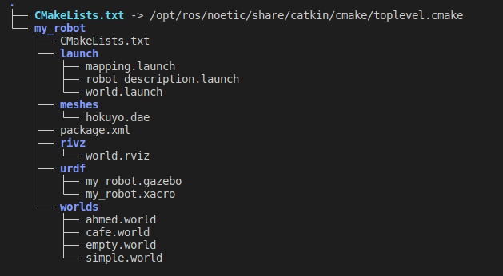
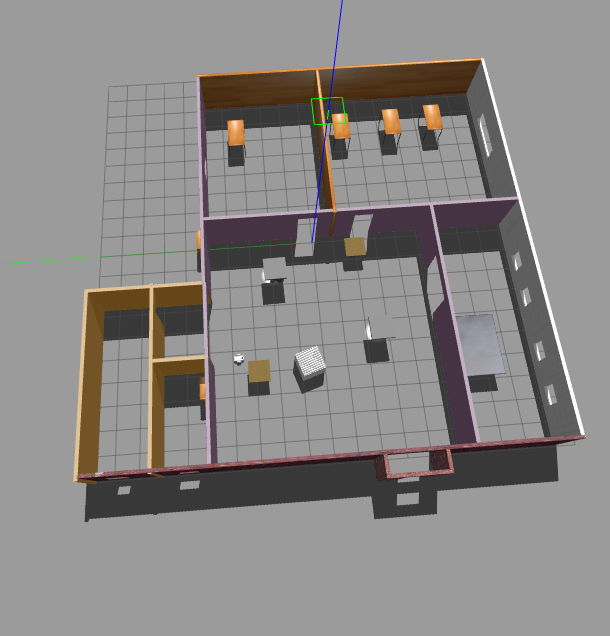
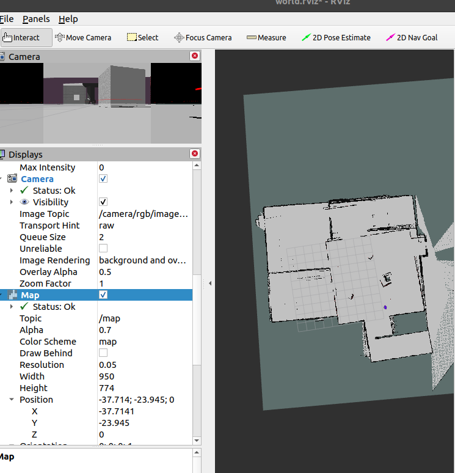
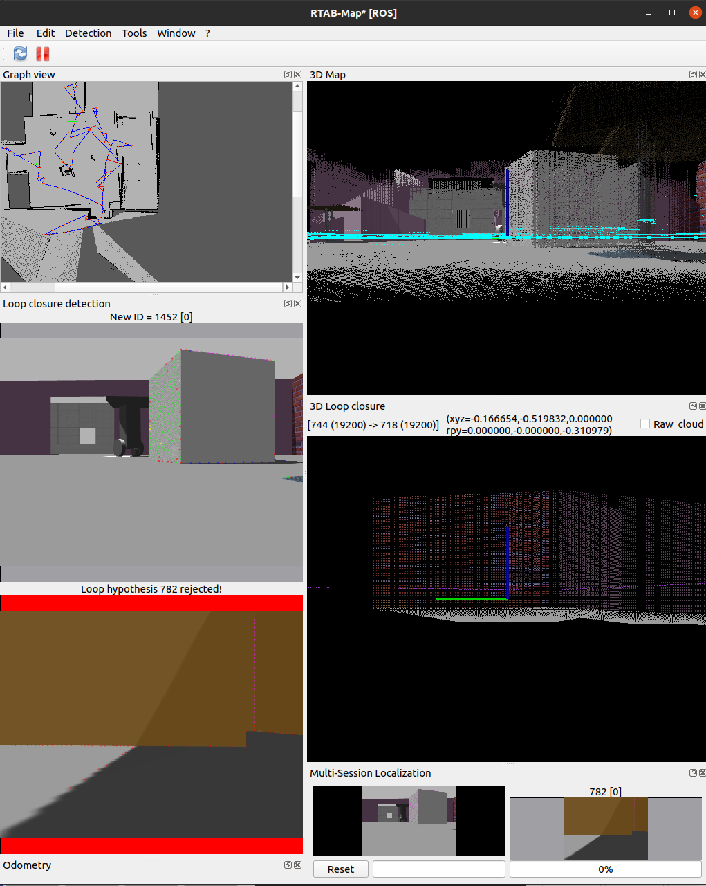
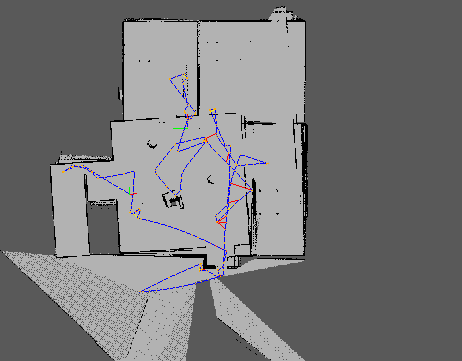

# Map_My_World

## Project Goal:
- Mapping the world using the RTAB-Map package to generate a map using an RGB-D camera and a laser scan attached to the robot.
- A 3-wheeled robot rover is used in this project.

## Project Structure:


### my_robot package:

- **design:** This package contains the robot's design Xacro file, defining the robot's structure, including the chassis, two wheels attached with two hinges, and two fixed casters.

#### Sensors:
- These sensors are attached to the robot's chassis, including a RGB-D camera and a Hokuyo LIDAR sensor.

#### Launch:
- Contains launch files that bring up the robot in the Gazebo simulation environment, incorporating the Xacro design and the Gazebo plugin libgazebo_ros_diff_drive for publishing odometry data, camera images, LIDAR data, and the controller for velocity and angular control in the x, y, and z directions.
- It also includes an RViz configuration to visualize sensor data.

### RTAB-Map Package:
- **mapping.launch:** Contains all RTAB-Map configurations with parameters and launches the RTAB-Map node for visualization.

## Output Screenshots:
- Gazebo world used in this project:
  

- RViz output map:
  

- RTAB-Map Whole Viz Window:
  

- Graph View Output:
  

## Run the Project:
1. Launch the world:
    ```bash
    source devel/setup.zsh
    roslaunch my_robot world.launch
    ```

2. Launch mapping (RTAB-Map):
    ```bash
    roslaunch my_robot mapping.launch
    ```
